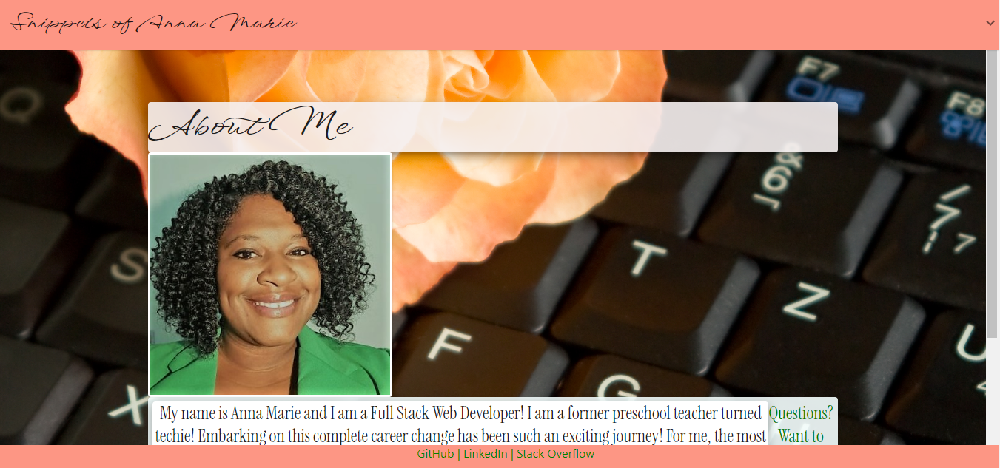

  # Snippets of Anna Marie

  

  [Deployed app](https://ampatte.github.io/snippets-of-annamarie)

  [Github repo](https://github.com/ampatte/snippets-of-annamarie)

  ## Description
  React Challenge: Professional Portfolio. A single page application with navigation to multiple components and links to a selection of my projects.
    

  ## Table of Contents
  - [Installation Instructions](#Installation)
  - [Usage Information](#Usage)
  - [Contribution Guidelines](#Contribution)
  - [Test Instructions](#Test)
  - [Questions](#Questions)
  - [License](#License)
  
  ## Installation
  This application runs in a browser. Just follow the url.

  ## Usage
  This app was created as a homework assignment to expand skills in React. It showcases other projects and assignments that I have created or made contributions. This is was created using create-react-app along with Material UI and React-Router-Dom installed for added functionality.

  
  
  ## Contribution
  Anna Marie. I am the only contributor.

  ## Test
  This can be tested by by navigating through all of the links.

  ## Questions?
  - [Github link](https://github.com/ampatte)
  - [Email link](ampatte717@gmail.com)
  - Complete the form on the Contact page 

  ## License
    This project is covered under the MIT license.(https://choosealicense.com/licenses/mit/)
